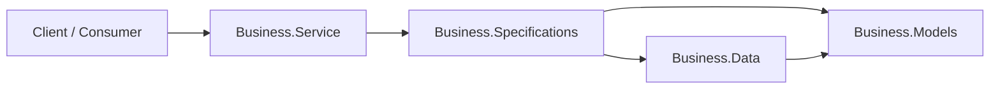
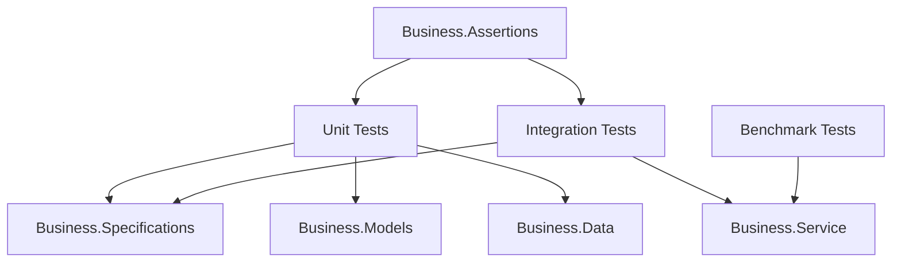

# Project Architecture Blueprint

**Last Updated**: June 28, 2026  
**Framework**: .NET 8.0  
**Architecture Pattern**: Layered / Clean Architecture Template  
**Project Type**: ASP.NET Core Web Service Template

---

## 1. Architecture Overview

This solution is a .NET 8 starter template that follows a layered architecture with a clear separation between the web entry point, business behavior, domain models, and data access concerns. The current implementation is intentionally minimal, but the project structure is already organized to support future growth into a full business application.

### Guiding Principles

- Separation of concerns across the solution projects
- Clear dependency direction from outer layers to inner layers
- Testability through project-level isolation and dedicated test projects
- Extensibility by adding new services, models, and endpoints in the appropriate layer
- Consistency with common ASP.NET Core and .NET conventions

### Current Architectural Reality

The codebase currently contains:
- A minimal ASP.NET Core host in Business.Service
- A domain model project for shared types
- A business logic project for use-case orchestration
- A data-access project scaffolded for future persistence work
- A full suite of test projects organized by scope

This means the architecture is present as a blueprint and a foundation, rather than a fully implemented business domain.



---

## 2. Solution Structure

```text
solution-template/
├── src/
│   ├── Business.Service/         # ASP.NET Core host and HTTP entry point
│   ├── Business.Specifications/  # Business logic and orchestration
│   ├── Business.Models/          # Domain entities, DTOs, and shared types
│   └── Business.Data/            # Data access layer scaffold
├── tests/
│   ├── unit/                     # Unit test projects by domain
│   ├── integration/              # Integration test project
│   ├── benchmark/                # Performance-oriented test project
│   └── assertions/               # Shared assertion helpers
├── docs/                         # Documentation
└── solution-template.sln         # Visual Studio solution file
```

---

## 3. Architectural Layers

### 3.1 Layer Responsibilities

- Business.Service: Handles HTTP concerns, routing, request/response shaping, and application startup
- Business.Specifications: Contains business rules, service orchestration, and domain workflows
- Business.Models: Holds shared domain concepts and contract models without infrastructure dependencies
- Business.Data: Provides data access abstractions and persistence implementation points

### 3.2 Dependency Flow

The intended dependency direction is:
- Business.Models is the innermost layer
- Business.Data depends on Business.Models
- Business.Specifications depends on Business.Models and Business.Data
- Business.Service depends on the lower layers and exposes their capabilities over HTTP

This keeps the domain model independent from transport and persistence concerns.

---

## 4. Core Components

### 4.1 Business.Service

Purpose: Enter the application and expose API behavior.

Current implementation:
- A minimal web app built with ASP.NET Core
- A single sample endpoint for weather forecast data
- Built-in dependency injection and hosting pipeline

Extension pattern:
- Add new endpoint groups for domain features
- Register services in the composition root
- Keep HTTP concerns limited to request/response handling

### 4.2 Business.Specifications

Purpose: Encapsulate business workflows and use cases.

Expected role:
- Implement feature-specific workflows
- Coordinate calls to repositories and domain models
- Keep business rules out of the transport layer

### 4.3 Business.Models

Purpose: Define the domain vocabulary and cross-cutting contracts.

Expected role:
- Hold entities, value objects, and DTOs
- Remain free of infrastructure and web-specific dependencies
- Serve as the shared model boundary between layers

### 4.4 Business.Data

Purpose: Offer a persistence boundary for the application.

Current state:
- The project exists as a scaffold and is ready for repository implementations

Expected role:
- Encapsulate database access behind abstractions
- Keep data access concerns separate from business logic
- Support future repository, unit-of-work, or ORM patterns

---

## 5. Dependency Injection and Composition

The application uses ASP.NET Core's built-in dependency injection container. The composition root is in Business.Service and is the place where services are registered for the rest of the application.

Recommended pattern:
- Register interfaces and implementations in the startup pipeline
- Favor scoped lifetimes for request-bound work
- Use singleton only for stateless shared services
- Keep infrastructure wiring in the host project, not in the domain layer

---

## 6. Data Architecture

At the moment, the solution does not yet include a concrete persistence implementation. The intended model is:

- Business.Models defines the domain entities and DTOs
- Business.Data provides repository abstractions and persistence implementations
- Business.Specifications consumes the data layer without owning storage details

This structure allows the application to evolve from a template into a fully persistent service without forcing a premature persistence choice.

---

## 7. Cross-Cutting Concerns

### 7.1 Configuration

- Configuration is loaded through ASP.NET Core's standard configuration providers
- appsettings.json and appsettings.Development.json are the default sources
- Environment-specific settings can be introduced as the application grows

### 7.2 Logging and Diagnostics

- The host project can use the standard logging abstractions provided by ASP.NET Core
- Structured logging and request tracing should be introduced as the service expands

### 7.3 Error Handling

- HTTP errors should be handled at the boundary in Business.Service
- Business rules and invalid states should be surfaced as clear exceptions or result types from lower layers
- Consistent error responses should be standardized as the API grows

---

## 8. Service Communication Patterns

The current implementation uses a simple REST-style request/response model over HTTP.

Expected communication model:
- HTTP endpoints in Business.Service
- Request and response DTOs in Business.Models or API-specific contracts
- Business.Specifications handles the workflow behind each endpoint
- Business.Data encapsulates any storage interactions

This keeps the public API boundary separate from the internal business behavior.

---

## 9. Testing Architecture

The repository already includes a layered testing strategy with separate test projects for unit, integration, benchmark, and assertion concerns.



### Testing Strategy

- Unit tests validate isolated components and business behavior
- Integration tests verify interactions across the service boundary
- Benchmark tests can be used to assess performance-sensitive paths
- Shared assertions help keep test code consistent and readable

---

## 10. Deployment Architecture

The solution is designed for a standard ASP.NET Core deployment model:

- The host application runs on Kestrel through the ASP.NET Core pipeline
- Configuration can be supplied through appsettings and environment variables
- The solution is ready to be deployed as a web service in a container, VM, or cloud-hosted environment

No custom messaging, event bus, or distributed-service topology is implemented yet.

---

## 11. Extension and Evolution Patterns

### Adding a New Feature

1. Define the domain concept in Business.Models
2. Add persistence support in Business.Data
3. Implement orchestration or business rules in Business.Specifications
4. Expose behavior through Business.Service
5. Add tests in the matching test project

### Recommended Constraints

- Keep business logic away from the HTTP layer
- Avoid introducing direct dependencies from inner layers to outer layers
- Prefer interfaces and dependency injection for infrastructure seams
- Add tests when behavior or contracts change

---

## 12. Architecture Governance

To keep the architecture consistent as the solution grows:

- Preserve the layer boundaries when adding new code
- Place new features in the appropriate project rather than scattering them into the host project
- Update this document when the architecture evolves beyond the current template state
- Review new dependencies to ensure they follow the established direction of flow

---

## 13. Blueprint for New Development

When implementing new work, start with the layer that owns the concern:

- API endpoints belong in Business.Service
- Business workflows belong in Business.Specifications
- Shared domain concepts belong in Business.Models
- Storage concerns belong in Business.Data

This template is intentionally simple, but it establishes a durable structure for future expansion into a richer domain-driven service.

### Review Cadence

- Review this document when the solution structure changes significantly
- Update it whenever new cross-cutting concerns or deployment patterns are introduced
- Keep the blueprint aligned with the actual implementation rather than aspirational design
